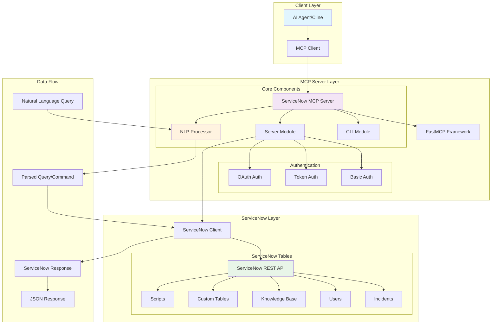

# ServiceNow MCP Server - Project Analysis

## Overview

The ServiceNow MCP Server is a **Model Context Protocol (MCP) server** that provides an interface between AI agents and ServiceNow instances. It enables natural language interactions with ServiceNow, allowing users to query, create, update, and manage ServiceNow records using conversational commands.

## Architecture Diagram



## How It Works

### 1. **Protocol Layer**
- Uses the **Model Context Protocol (MCP)** standard for AI agent communication
- Built on the FastMCP framework for rapid MCP server development
- Supports both stdio and SSE transport protocols

### 2. **Authentication Flow**
The server supports three authentication methods:
- **Basic Auth**: Username/password authentication
- **Token Auth**: Bearer token authentication
- **OAuth**: Full OAuth 2.0 flow with token refresh

### 3. **Natural Language Processing**
The NLP processor converts human language into ServiceNow API calls:
- **Search Queries**: "find all incidents about email" → ServiceNow text query
- **Update Commands**: "Close incident INC001 with resolution: fixed" → API update call
- **Script Management**: "update @script.js, it's a script include" → Script upload

### 4. **ServiceNow Integration**
- Direct REST API integration with ServiceNow instances
- Support for all major ServiceNow tables (incidents, problems, changes, users, etc.)
- Schema introspection and table discovery
- Script management capabilities

## Key Features

### 📋 **Resources (Read-Only Data Access)**
- `servicenow://incidents` - List recent incidents
- `servicenow://incidents/{number}` - Get specific incident
- `servicenow://users` - List users
- `servicenow://knowledge` - List knowledge articles
- `servicenow://tables` - List available tables
- `servicenow://tables/{table}` - Get records from specific table
- `servicenow://schema/{table}` - Get table schema

### 🛠️ **Basic Tools (CRUD Operations)**
- **create_incident** - Create new incidents
- **update_incident** - Update existing incidents
- **search_records** - Text-based record search
- **get_record** - Retrieve specific records by sys_id
- **perform_query** - Execute ServiceNow queries
- **add_comment** - Add customer-visible comments
- **add_work_notes** - Add internal work notes

### 🧠 **Natural Language Tools**
- **natural_language_search** - Search using conversational queries
  - "find all incidents about SAP"
  - "show me high priority incidents"
  - "search for closed problems"

- **natural_language_update** - Update records using natural language
  - "Update incident INC001 saying I'm working on it"
  - "Close incident INC002 with resolution: fixed the issue"
  - "Set incident INC003 to in progress"

- **update_script** - Manage ServiceNow scripts
  - Script includes, business rules, client scripts
  - Upload from local files to ServiceNow

### 🔐 **Security Features**
- Multiple authentication methods
- Secure credential handling via environment variables
- OAuth token refresh capability
- Role-based access control (inherited from ServiceNow)

## Technical Implementation

### **Core Classes**

1. **ServiceNowMCP** - Main server class that orchestrates all functionality
2. **ServiceNowClient** - HTTP client for ServiceNow REST API interactions
3. **NLPProcessor** - Natural language processing for query parsing
4. **Authentication Classes** - BasicAuth, TokenAuth, OAuthAuth for different auth methods

### **Data Models**
- **IncidentCreate/IncidentUpdate** - Pydantic models for incident operations
- **QueryOptions** - Configuration for ServiceNow queries
- **ScriptUpdateModel** - Model for script management operations

### **Natural Language Examples**

#### Search Operations:
```
"find all incidents about email"
→ Query: incidents table with text search for "email"

"show me all incidents with high priority"
→ Query: incidents where priority=1

"search for incidents in progress"
→ Query: incidents where state=2
```

#### Update Operations:
```
"Update incident INC0010001 saying I'm working on it"
→ Add comment + set state to In Progress

"Close incident INC0010002 with resolution: fixed the issue"
→ Set state to Closed + add close notes

"Set incident INC0010003 to in progress"
→ Update state to In Progress
```

## Deployment Options

### **Command Line Usage**
```bash
python -m mcp_server_servicenow.cli \
  --url "https://instance.service-now.com/" \
  --username "user" \
  --password "pass"
```

### **Environment Variables**
```bash
export SERVICENOW_INSTANCE_URL="https://instance.service-now.com/"
export SERVICENOW_USERNAME="username"
export SERVICENOW_PASSWORD="password"
```

### **Integration with AI Tools (Cline)**
```json
{
  "mcpServers": {
    "servicenow": {
      "command": "/path/to/python",
      "args": ["-m", "mcp_server_servicenow.cli", "--url", "..."],
      "disabled": false
    }
  }
}
```

## Project Structure

```
servicenow-mcp/
├── mcp_server_servicenow/          # Main package
│   ├── __init__.py                 # Package initialization
│   ├── cli.py                      # Command-line interface
│   ├── server.py                   # Core MCP server implementation
│   └── nlp.py                      # Natural language processing
├── tests/                          # Test suite
│   ├── __init__.py
│   └── test_nlp.py                # NLP functionality tests
├── servicenow-mcp.py              # Standalone server script
├── pyproject.toml                 # Project configuration
├── requirements.txt               # Dependencies
└── README.md                      # Documentation
```

## Use Cases

### **IT Service Management**
- Incident creation and management through natural language
- Automated ticket routing and updates
- Knowledge base searches
- Problem and change management

### **AI-Powered Automation**
- Conversational ServiceNow interactions
- Automated incident resolution workflows
- Natural language reporting and analytics
- Script deployment and management

### **Development & Operations**
- ServiceNow script management from local development environment
- Integration with CI/CD pipelines
- Automated documentation updates
- Custom application deployment

## Benefits

1. **Natural Language Interface** - No need to learn ServiceNow query syntax
2. **AI Agent Integration** - Seamless integration with AI assistants like Cline
3. **Multiple Auth Methods** - Flexible authentication for different environments
4. **Extensible Architecture** - Easy to add new tables and functionality
5. **Type Safety** - Pydantic models ensure data validation
6. **Comprehensive Testing** - Unit tests for critical functionality

This project effectively bridges the gap between natural language AI interfaces and enterprise ServiceNow systems, enabling more intuitive and efficient IT service management workflows.